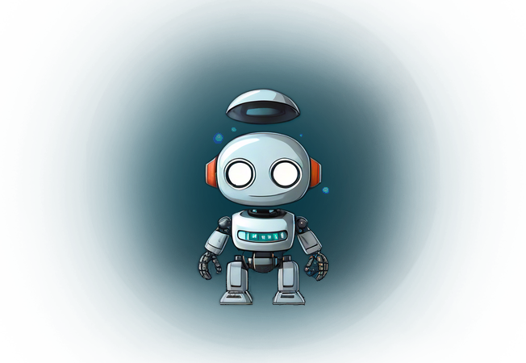
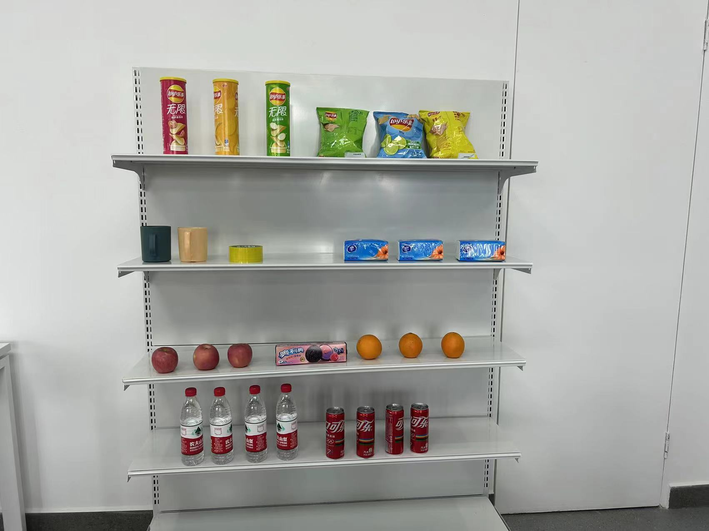

<div align=center>
  

<h1 style="margin-top: -20px;">  视听融合感知智能引擎平台 </h1> 

<div align="center">

📕中文版README | 📗 [英文版README](./README_en.md)

</div>

[📕 Chinese README](./README.md) | 📗 English README

</div>

### 📻 Installation Guide

Before using our model, you need to ensure that all necessary dependencies are installed in your environment. These dependencies cover various libraries and tools required for the model's operation, ensuring a smooth inference process.

Please follow these steps for the installation:

1. **Open the Terminal or Command Prompt**: Depending on your operating system, open the corresponding command-line interface.
2. **Install dependencies using pip**: Enter the following command to install the required Python packages and libraries using pip.

```bash
pip install -r requirements.txt
```


### 🚀 Inference Guide

After installing all the necessary dependencies, you can start using our model for inference. We provide two ways of performing inference: using the terminal and using the interactive inference.

Here, we will use the example image `asserts/demo.jpg` for illustration:



#### 1. Inference using the Terminal

If you want to directly run the inference script in the terminal, you can use the following command:

```bash
python chatme.py --image asserts/demo.jpg --question "How many apples are there on the shelf?"
```

This command will load the pre-trained model and perform inference using the provided image (`demo.jpg`) and question (`"How many apples are there on the shelf?"`).

The model will analyze the image and attempt to answer the question. The inference result will be output to the terminal in text form, for example:

```
Xiaochuan: There are three apples on the shelf.
```

#### 2. Interactive Inference

In addition to using the terminal for inference, you can also use the interactive inference feature to interact with the large model in real-time. To start the interactive terminal, run the following command:

```bash
python main.py
```

This command will launch an interactive terminal that waits for you to enter the image path. You can type the image path (e.g., `asserts/demo.jpg`) in the terminal and press Enter.

The model will perform inference based on the provided image and wait for you to enter a question.

Once you enter a question (e.g., `"How many apples are there on the shelf?"`), the model will analyze the image and attempt to answer it. The inference result will be output to the terminal in text form, for example:

```bash
Image Path >>>>> asserts/demo.jpg
User: How many apples are there on the shelf?
Xiaochuan: There are three apples on the shelf.
```

Using this approach, you can easily interact with the model and ask it various questions.


### 🧾 References

#### 📈 Benchmark ####

  - [AGE Challenge Dataset](https://age.grand-challenge.org)

  - [COVID-DA Dataset](https://drive.google.com/file/d/1w2brbYLn1s1hvmLkKKsBsm1mCbz4F512/view?usp=sharing)

  - [Visually Aligned Sound (VAS) Dataset](https://drive.google.com/file/d/14birixmH7vwIWKxCHI0MIWCcZyohF59g/view?usp=sharing)

#### 📷 Visual Perception

- [2D Perception](Visual-Perception/2D-Perception/)

  - [Improving the Generalization of Segmentation Foundation Model under Distribution Shift via Weakly Supervised Adaptation](https://github.com/zhang-haojie/wesam)

  - [Revisiting Realistic Test-Time Training: Sequential Inference and Adaptation by Anchored Clustering Regularizad Self-Training](https://github.com/Gorilla-Lab-SCUT/TTAC2)

  - [Towards Real-World Test-Time Adaptation: Tri-Net Self-Training with Balanced Normalization](https://github.com/Gorilla-Lab-SCUT/TRIBE)

  - [Revisiting Realistic Test-Time Training: Sequential Inference and Adaptation by Anchored Clustering](https://github.com/Gorilla-Lab-SCUT/TTAC)
 
  - [Distillation Using Oracle Queries for Transformer-based Human-Object Interaction Detection](https://github.com/SherlockHolmes221/DOQ)
 
  - [High-resolution networks (HRNets) for Image classification](https://github.com/HRNet/HRNet-Image-Classification)
 
  <!-- - [Late Fusion via Subspace Search with Consistency Preservation](https://github.com/xiangfasong/HCMF) -->
 
  - [Intra- and Inter-Slice Contrastive Learning for Point Supervised OCT Fluid Segmentation](https://github.com/lphxx6222712/ISCLNet)
 
  - [Partitioning Stateful Data Stream Applications in Dynamic Edge Cloud Environments](https://github.com/Dshaoshuai/Partitioning-stateful-data-stream-applications-in-dynamic-edge-cloud-environments)
  
  <!-- - !! [Learning defense transformations for counterattacking adversarial examples](https://github.com/SCUTjinchengli/DefenseTransformer) -->
 
  <!-- - !! 2019 [Multi-marginal Wasserstein GAN](https://github.com/deepmo24/MWGAN) -->
 
  <!-- - !! 2018 [Adversarial Learning with Local Coordinate Coding](https://github.com/guoyongcs/LCCGAN) -->
 
  - [Closed-loop Matters: Dual Regression Networks for Single Image Super-Resolution](https://github.com/guoyongcs/DRN)
 
  - [Dense Regression Network for Video Grounding](https://github.com/Alvin-Zeng/DRN)
 
  - [Graph Convolutional Networks for Temporal Action Localization](https://github.com/Alvin-Zeng/PGCN)
 
  - [NAT: Neural Architecture Transformer for Accurate and Compact Architectures](https://github.com/guoyongcs/NAT)
 
  <!-- - !! 2018 [Discrimination-aware Channel Pruning for Deep Neural Networks](https://github.com/SCUT-AILab/DCP) -->
 
  - [Efficient Test-Time Model Adaptation without Forgetting](https://github.com/mr-eggplant/EATA)
 
  - [Breaking the Curse of Space Explosion: Towards Effcient NAS with Curriculum Search](https://github.com/guoyongcs/CNAS)
 
  - [Contrastive Neural Architecture Search with Neural Architecture Comparators](https://github.com/chenyaofo/CTNAS)
 
  - [Domain-Symnetric Networks for Adversarial Domain Adaptation](https://github.com/Gorilla-Lab-SCUT/SymNets)
 
  - [RSPNet: Relative Speed Perception for Unsupervised Video Representation Learning](https://github.com/PeihaoChen/RSPNet)
 
  <!-- - !! 2017[MPGL](https://github.com/donggong1/mpgl) -->
 
  - [Source-free Domain Adaptation via Avatar Prototype Generation and Adaptation](https://github.com/SCUT-AILab/CPGA)
 
  - [Self-Supervised Gait Encoding with Locality-Aware Attention for Person Re-Identification](https://github.com/Kali-Hac/SGE-LA)
 
  - [Towards Stable Test-Time Adaptation in Dynamic Wild World](https://github.com/mr-eggplant/SAR)
 
  - [Detecting Adversarial Data by Probing Multiple Perturbations Using Expected Perturbation Score](https://github.com/ZSHsh98/EPS-AD)
 
  - [Masked Motion Encoding for Self-Supervised Video Representation Learning](https://github.com/XinyuSun/MME)
 
  <!-- - !! [Hard Sample Matters a Lot in Zero-Shot Quantization](https://github.com/lihuantong/HAST) -->
 
  - [Source-free Domain Adaptation via Avatar Prototype Generation and Adaptation](https://github.com/SCUT-AILab/CPGA)
 
  - [Dynamic Extension Nets for Few-shot Semantic Segmentation](https://github.com/lizhaoliu-Lec/DENet)
 
  - [Densely-Anchored Sampling for Deep Metric Learning](https://github.com/lizhaoliu-Lec/DAS)
 
  - [Prototype-Guided Continual Adaptation for Class-Incremental Unsupervised Domain Adaptation](https://github.com/Hongbin98/ProCA)
 
  <!-- - !! ["Generative Low bitwidth Data Free Quantization](https://github.com/xushoukai/GDFQ) -->
 
  <!-- - !! [Deep Transferring Quantization](https://github.com/xiezheng-cs/DTQ) -->
 
  - [Attention Guided Network for Retinal Image Segmentation](https://github.com/HzFu/AGNet)
 
  <!-- - !! [Distinguishing Differences Matters: Focal Contrastive Network for Peripheral Anterior Synechiae Recognition](https://github.com/YifYang993/FC-Net) -->
 
  <!-- - !! 2018 [Cartoon-to-Photo Facial Translation with Generative Adversarial Networks](https://github.com/JunhongH/CP-GAN) -->
 
  <!-- - !! [QTool: A Low-bit Quantization Toolbox for Deep Neural Networks in Computer Vision](https://github.com/ziplab/QTool) -->
 
  <!-- - !! 2019 [Facial Image-to-Video Translation by a Hidden Affine Transformation](https://github.com/sunlightsgy/AffineGAN) -->
 
  <!-- - !! [Pareto-aware Neural Architecture Generation for Diverse Computational Budgets](https://github.com/guoyongcs/PNAG) -->
    
  - [Towards Hard-Positive Query Mining for DETR-based Human-Object Interaction Detection/Object Detection](https://github.com/MuchHair/HQM.git)
    
  - [Glance and Gaze: Inferring Action-aware Points for One-Stage Human-Object Interaction Detection](https://github.com/SherlockHolmes221/GGNet.git)
    
  - [Polysemy Deciphering Network for Human-Object Interaction Detection](https://github.com/MuchHair/PD-Net.git)
 
  - [Bidirectional Posture-Appearance Interaction Network for Driver Behavior Recognition](https://github.com/SCUT-AILab/BPAI-Net)
 
  - [Improving Generative Adversarial Networks with Local Coordinate Coding](https://github.com/SCUTjinchengli/LCCGAN-v2)
 
  <!-- - !! [GCM: Graph Convolutional Module for Temporal Action Localization in Videos](https://github.com/Alvin-Zeng/GCM) -->
 
  <!-- - !! 2019 [Towards Accurate and Compact Architectures via Neural Architecture Transformer](https://github.com/guoyongcs/NATv2) -->
 
  - [Collaborative Unsupervised Domain Adaptation for Medical Image Diagnosis](https://github.com/Vanint/CoUDA)
 
  <!-- - !! 2019 [Auto-Embedding Generative Adversarial Networks for High Resolution Image Synthesis](https://github.com/guoyongcs/AEGAN) -->
 
  <!-- - !!! [LayerOT](https://github.com/SCUTjinchengli/LayerOT) -->
 
  <!-- - [Towards Effective Deep Transfer via Attentive Feature Alignment](https://github.com/xiezheng-cs/AFA) -->
 
  <!-- - !! [Content-Aware Convolution for Efficient Deep Neural Networks](https://github.com/guoyongcs/CAC) -->
 
  <!-- - !! [Multi-way Backpropagation for Training Compact Deep Neural Networks](https://github.com/tanmingkui/multiwaybp) -->
 
    
- [3D Perception](Visual-Perception/3D-Perception/)

  - [SAM-6D: Segment Anything Model Meets Zero-Shot 6D Object Pose Estimation](https://github.com/JiehongLin/SAM-6D)

  - [Frustum ConvNet: Sliding Frustums to Aggregate Local Point-Wise Features for Amodal 3D Object Detection](https://github.com/Gorilla-Lab-SCUT/frustum-convnet)

  - [Instance Segmentation in 3D Scenes using Semantic Superpoint Tree Networks](https://github.com/Gorilla-Lab-SCUT/SSTNet)

  - [VISTA: Boosting 3D Object Detection via Dual Cross-VIew SpaTial Attention](https://github.com/Gorilla-Lab-SCUT/VISTA)
 
  - [A Self-Supervised Gait Encoding Approach with Locality-Awareness for 3D Skeleton Based Person Re-Identification](https://github.com/Kali-Hac/Locality-Awareness-SGE)

  - [Deep Multi-View Learning Using Neuron-Wise Correlation-Maximizing Regularizers](https://github.com/JiehongLin/CorrReg)
 
  - [A Skeleton-Bridged Deep Learning Approach for Generating Meshes of Complex Topologies From Single RGB Images](https://github.com/Gorilla-Lab-SCUT/SkeletonNet)

  - [Perception-Aware Multi-Sensor Fusion for 3D LiDAR Semantic Segmentation](https://github.com/ICEORY/PMF)
 
  - [CPEM: Consistent Parameter Estimation Model](https://github.com/deepmo24/CPEM)
 
  - [CR-NeRF: Cross-Ray Neural Radiance Fields for Novel-view Synthesis from Unconstrained Image Collections](https://github.com/YifYang993/CR-NeRF-PyTorch)
 
  - [Contextual Point Cloud Modeling for Weakly-supervised Point Cloud Semantic Segmentation](https://github.com/lizhaoliu-Lec/CPCM)
 
  - [Quasi-Balanced Self-Training on Noise-Aware Synthesis of Object Point Clouds for Closing Domain Gap](https://github.com/gorilla-lab-scut/qs3)

  - [HelixSurf: A Robust and Efficient Neural Implicit Surface Learning of Indoor Scenes with Iterative Intertwined Regularization](https://github.com/Gorilla-Lab-SCUT/HelixSurf)


#### 🎧 Audio

- [Automatic Speech Recognition](https://github.com/qiaoweima/chatbot_ASR)
  
- [Dialogue System](https://github.com/qiaoweima/chatbot_SER)
  
- [Text To Speech](https://github.com/qiaoweima/chatbot_TTS.git)
  
- [Audio Anti-spoofing](https://github.com/qiaoweima/Audio-Anti-Spoofing/tree/main)
  
- [Blizzard_Challenge](https://github.com/qiaoweima/Blizzard_Challenge)

- [Voice Activity Detection](https://github.com/HolgerBovbjerg/SSL-PVAD)

- [RegNet](https://github.com/PeihaoChen/regnet)
  
#### 💬 NLP

- [How to Train Your Agent to Read and Write](https://github.com/menggehe/DRAW)

- [CogVLM](https://github.com/THUDM/CogVLM.git)

- [Qwen](https://github.com/QwenLM/Qwen.git)

#### 🔮 Multi-Modal

- [Test-Time Model Adaptation for Visual Question Answering with Debiased Self-Supervisions](https://github.com/Zhiquan-Wen/TDS)

- [Debiased Visual Question Answering from Feature and Sample Perspectives](https://github.com/Zhiquan-Wen/D-VQA)

- [Intelligent Home 3D: Automatic 3D-House Design from Linguistic Descriptions Only](https://github.com/chenqi008/HPGM)

- [Cross-Modal Relation-Aware Networks for Audio-Visual Event Localization](https://github.com/FloretCat/CMRAN)

- [Cascade Reasoning Network for Text-based Visual Question Answering](https://github.com/guanghuixu/CRN_tvqa)

- [Length-Controllable Image Captioning](https://github.com/bearcatt/LaBERT)

- [V2C: Visual Voice Cloning](https://github.com/chenqi008/V2C)

#### 🤖 Robotic

- [Learning Active Camera for Multi-Object Navigation](https://github.com/PeihaoChen/ActiveCamera)

- [Weakly-Supervised Multi-Granularity Map Learning for Vision-and-Language Navigation](https://github.com/PeihaoChen/WS-MGMap)

- [Learning Vision-and-Language Navigation from YouTube Videos](https://github.com/JeremyLinky/YouTube-VLN)

<!-- #### Others

 - [Rat-Crypto-Trader](https://github.com/louisoutin/rat_crypto_trader)
   
 - [PPN](https://github.com/kshre/PPN)
   
 - [OA3](https://github.com/Vanint/OA3) -->
